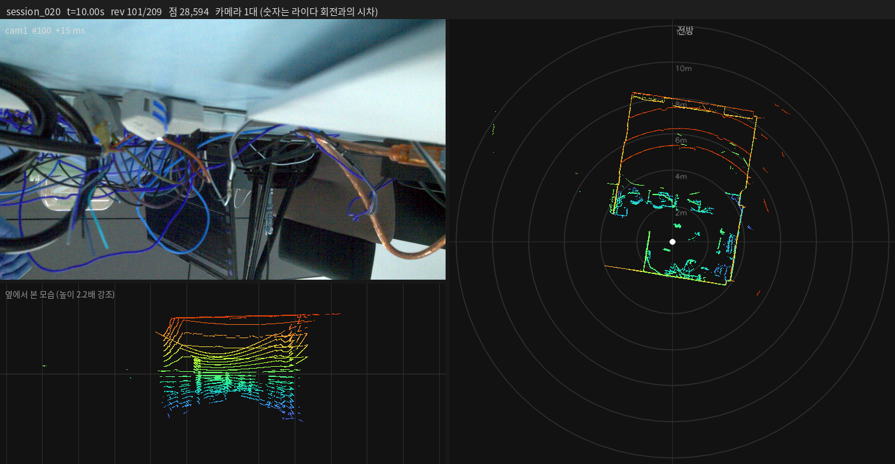
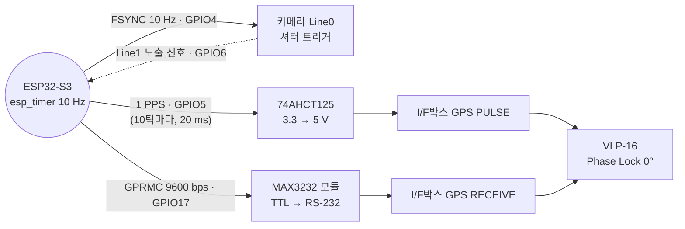

# 시간동기화 — 카메라·라이다 하드웨어 시각 동기

Daheng MER2-240-159U3C 카메라와 Velodyne VLP-16 라이다를 **ESP32-S3 하나의 타이머**에 묶어서, 카메라 셔터가 열리는 순간과 라이다가 정해진 방위각을 지나는 순간을 일치시킨 작업의 정리입니다.

작업 기간: 2026-09-09, 2026-09-14 ~ 09-15

---

## 결과

최종 검증 세션 [`results/session_020`](results/session_020) (카메라 1대 + 라이다, 20초). 검산기 전 항목 통과.

| 항목 | 값 |
|---|---|
| 셔터 순간 라이다 방위각 | 평균 **−0.007°**, 표준편차 0.34°, 범위 ±0.92° (목표 0°) |
| **카메라 ↔ 라이다 시간 오차** | 평균 **−0.000002 s**, 표준편차 **0.000094 s**, 최대 0.00026 s |
| 카메라 트리거 → 실제 노출 시작 | **12.8 µs 고정** (12 ~ 14 µs), 흔들림 ±1 µs |
| 트리거 ↔ 노출 확인 (Line1) | 200 / 200 |
| 트리거 번호 ↔ 사진 번호 대응 | 200 / 200 (offset 1) |
| 시간이 지나며 벌어짐 | 없음 — 두 센서가 같은 타이머에 묶여 있음 |
| 라이다 PPS / Phase Lock | `Locked` 전 구간 / `On`, offset 0°, 플래시에 저장 |
| GPRMC | 체크섬 정상, 라이다 타임스탬프의 초 = GPRMC 문장의 초 |
| 카메라 / 라이다 | 200장, FrameID 끊김 0 / 패킷 유실 0 |

```bash
cd code && python3 sync_report.py ../results/session_020
```



---

## 오차는 어디서 오나

위의 오차는 **카메라 ↔ 라이다를 직접 비교한 값**이 아니라, 각 센서를 **ESP32 타이머 기준으로** 잰 두 값이 합쳐진 것입니다.

| 기준: ESP32 타이머 | 값 | 성격 |
|---|---|---|
| **카메라** 트리거 → 노출 시작 | 12.8 µs, 흔들림 **±1 µs** | 고정값 → 빼면 됨 |
| ESP32 FSYNC ↔ PPS | 같은 레지스터 쓰기 (ns 수준) | 코드로 확인 |
| **라이다** 모터 각도 (셔터 순간 목표 0°) | 흔들림 **±94 µs** (±0.34°) | 라이다 내부 기계적 한계 |
| 라이다 시계 ↔ PPS | 라이다 내부 고정 지연 | **미측정** |

카메라 ↔ 라이다 흔들림 약 94 µs는 **거의 전부 라이다 모터 쪽**입니다. 세션별로 봐도 같습니다.

| 세션 | 상태 | 라이다 단독 흔들림 (카메라 무관) | 셔터 순간 오차 (표준편차) |
|---|---|---|---|
| 015 | **카메라 없음** | 109 µs | — |
| 016 | Line1 미연결 | 114 µs | — |
| 017 | Line1 미연결 | 110 µs | 106 µs |
| 019 | Line1 정상 | 93 µs | 95 µs |
| 020 | Line1 정상 | 93 µs | 94 µs |

카메라가 아예 없던 015에서도 같은 크기가 나오고, 매 세션 "셔터 순간 오차" ≈ "라이다 단독 흔들림"입니다. 이 흔들림은 매번 튀는 게 아니라 **몇 초에 걸쳐 천천히 떠돕니다** (이웃한 트리거끼리 차이 34 µs, 자기상관 0.95). 1초 안의 위치에 따른 패턴도 없어서, 카메라 쪽 offset 같은 **상수 보정으로는 줄일 수 없습니다.**

### 이 94 µs는 시계 오차가 아닙니다

라이다 **시계(타임스탬프)**는 PPS·GPRMC로 ESP32에 묶여 있고, 94 µs는 그 시계가 아니라 **모터가 목표 각도에서 벗어난 정도**입니다. 라이다 점 하나하나가 발사 시각(µs 단위)을 갖고 있으므로, 결합할 때 "셔터 순간 모터가 0°에 있었다"고 가정하지 말고 **점마다 셔터보다 몇 µs 앞인지 뒤인지를 타임스탬프로 계산**하면 이 흔들림은 오차에서 빠집니다. 그때 남는 오차는 카메라 ±1 µs와 라이다 내부 PPS 지연(고정, 미측정)입니다.

---

## 원리



1. **FSYNC와 PPS가 같은 순간에 나갑니다.** 펌웨어는 10 Hz 타이머 인터럽트 한 곳에서 FSYNC를 매 틱, PPS를 10틱마다 **같은 레지스터 쓰기**로 올립니다. 카메라 셔터는 항상 PPS 기준 0, 100, 200 … ms (+12.8 µs)에 열립니다.
2. **PPS + Phase Lock이 라이다 회전 위상을 고정합니다.** PPS가 들어오는 순간 라이다가 지정한 방위각(offset)을 보도록 모터를 맞춥니다. 600 rpm = 정확히 10 Hz라서 셔터가 열리는 매 순간 라이다는 offset 방향을 지납니다.
3. **GPRMC가 라이다 타임스탬프를 ESP32 시간축에 묶습니다.** 라이다의 '정시 이후 µs' 카운터가 문장의 분·초로 맞춰지므로, ESP32 로그의 트리거 시각을 라이다 시각으로 옮길 수 있습니다.
4. **Line1이 실제 노출을 확인합니다.** 카메라가 노출하는 동안 켜지는 신호를 ESP32가 µs 단위로 기록해서, 트리거를 놓쳤는지와 트리거 → 노출 지연을 알 수 있습니다.

### "같은 순간"의 정확한 의미

- **라이다가 offset 방향(지금 0°, 정면)을 보는 순간에 대해서**입니다. 라이다는 100 ms에 한 바퀴 돌아서 반대편(180°) 점들은 셔터보다 50 ms 앞이나 뒤에 찍힙니다. 카메라가 보는 방향의 각도를 Phase Lock `offset`에 넣어야 합니다.
- **사진은 8 ms 동안 빛을 모은 것**입니다. 그동안 라이다는 약 29° 돕니다. 결과는 노출 **시작** 기준입니다.
- **파일의 수신 시각으로 비교하면 15 ms 차이가 납니다.** `frames.csv`의 `host_recv_unix`는 사진이 PC에 **도착한** 시각이라 `노출시간 + 7.1 ms`만큼 늦습니다. 정확한 노출 시작은 `mcu_log.txt`의 트리거 시각 + 12.8 µs입니다.
- **GPRMC 시각은 실제 세계 시각이 아닙니다.** ESP32가 부팅할 때마다 12:00:00부터 세는 자체 시계입니다 (날짜 140826 고정).

---

## 최종 배선

자세한 내용과 측정 체크리스트는 [`배선.md`](배선.md)에 있습니다.

| 출발 | 도착 |
|---|---|
| ESP32 **GPIO5** | 74AHCT125 **2번** → **3번** → I/F박스 **GPS PULSE** |
| ESP32 **GPIO17** | MAX3232 모듈 **TXD** |
| MAX3232 모듈 **RS-232 포트 2번** | I/F박스 **GPS RECEIVE** |
| ESP32 **5V** / **GND** | MAX3232 모듈 **VCC** / **GND** |
| 카메라 HR25 **Pin8 (주황)** | ESP32 **GPIO6** + 4.7 kΩ 풀업 → 3.3 V |
| 카메라 HR25 **Pin7 (초록)** | ESP32 **GND** |
| ESP32 **GND** | 74AHCT125 **7번**·**1번**, I/F박스 **GND** (전부 공통) |
| ESP32 네이티브 **USB** 포트 | 노트북 (`/dev/ttyACM0`) |

> **MAX3232 모듈의 RXD는 연결하지 마세요.** 이 모듈은 **TXD가 입력, RXD가 출력**입니다. VCC 5 V에서 RXD는 5 V를 내보냅니다.

---

## 사용법

```bash
cd code
source /opt/ros/humble/setup.bash

python3 lidar_config.py                 # 라이다 PPS / NMEA / Phase Lock 상태
python3 record.py --duration 20         # 카메라 + 라이다 수집 (ESP32 핸드셰이크)
python3 record.py --lidar-only          # 카메라 없이 라이다만
python3 check_session.py sessions/session_NNN
python3 sync_report.py   sessions/session_NNN
python3 to_rosbag.py     sessions/session_NNN
python3 preview_session.py sessions/session_NNN --mp4
```

도구별 설명은 [`code/README.md`](code/README.md)에 있습니다.

> **현재 펌웨어는 PC가 ESP32 USB 시리얼을 읽어 주는 동안에만 PPS가 정상입니다.** 녹화 중에는 `record.py`가 시리얼을 읽으므로 문제없지만, 녹화 사이에는 라이다가 PPS를 잃습니다. [트러블슈팅 12번](트러블슈팅.md#12-esp32가-시리얼이-막히면-pps를-내리지-못함) 참고.

---

## 진행 경과

| 날짜 | 내용 |
|---|---|
| 09-09 | 라이다·카메라 연결 확인. 빈 폴더에서 수집 패키지 구축 (UDP→pcap 캡처, VLP-16 디코더, 검산기, rosbag 변환) |
| 09-09 | **주파수는 이미 10 Hz로 맞아 있었고**(3 ppm 차이) 문제는 **위상**이었음. 72.2 ms 어긋나 있었고 29분마다 한 프레임씩 밀림 |
| 09-09 | PPS `Absent`. 74AHCT125 버퍼를 넣고 **라이다 전원을 껐다 켜자** `Locked`. Phase Lock 적용 → 19시간에 한 프레임 |
| 09-09 | 남은 15 ms가 카메라 수신 지연(노출 + 전송)임을 노출 실험으로 확인 |
| 09-14 | 카메라 없이 라이다 타임스탬프만으로 위상 잠금을 판정하는 방법 추가 |
| 09-14 | Phase Lock이 전원 재투입 후 사라짐 → 플래시 저장(`/cgi/save`) 추가 |
| 09-14 | I/F박스 GND 미연결, 5V 레일 이상 해결. **ESP32가 USB 시리얼이 막히면 PPS를 내리지 못하는 문제** 발견 |
| 09-15 | MAX3232 모듈 GND 미연결, **모듈 입력이 TXD**였던 것을 찾음 → GPRMC 정상 수신 |
| 09-15 | ESP32 트리거 시각을 라이다 시각으로 옮겨 **셔터 순간 라이다 방위각** 측정 → ±0.1 ms |
| 09-15 | 카메라 Line1 배선(Pin7 GND 접촉) 해결 → **카메라 트리거 → 노출 12.8 µs** 측정, 검산기 전 항목 통과 |

문제별 원인과 해결 과정은 [`트러블슈팅.md`](트러블슈팅.md)에 시간순으로 정리했습니다.

---

## 남은 과제

1. **ESP32 시리얼 막힘 (펌웨어)** — PC가 시리얼을 읽지 않으면 PPS가 멈춥니다. `setup()`에 `Serial.setTxTimeoutMs(0);` 추가가 해결책입니다 (아직 적용 안 함).
2. **노출 지연 표본이 세션당 10개** — 펌웨어가 노출 기록을 `EXP_LOG_LIMIT = 10`줄로 제한합니다. 세션 전체로 12.8 µs ±1 µs를 확인하려면 이 값을 늘려야 합니다. 1번과 묶어 펌웨어 사본으로 만들면 됩니다.
3. **라이다 내부 PPS 지연** — 라이다 시계가 PPS 엣지에서 몇 µs 늦게 맞춰지는지는 외부로 볼 핀이 없어 측정하지 못했습니다. 제조사 사양 확인이 필요합니다.
4. **점별 타임스탬프 결합** — 라이다 모터 흔들림(±94 µs)을 오차에서 빼려면, 결합 도구가 모터 각도를 가정하지 않고 점별 발사 시각을 쓰도록 바꿔야 합니다.
5. **쓰지 않는 Line1 입력** — 카메라가 없는 채널(GPIO15 등)이 잡음을 받아 로그를 채운 적이 있습니다. 4.7 kΩ로 3.3 V에 묶어 두는 게 좋습니다.
6. **카메라 방향과 Phase Lock offset** — 카메라가 천장을 보고 있고 offset은 0°입니다. 카메라를 라이다 수평면 쪽으로 향하게 한 뒤 그 방위각을 offset에 넣어야 합니다.
7. **카메라 노출** — 8 ms / 8 dB에서 화소 평균 10/255로 어둡습니다. 노출은 80 ms(트리거 주기의 80%)를 넘길 수 없습니다.

---

## 폴더 구성

```
시간동기화/
├── README.md            이 문서
├── 배선.md               최종 배선, 부품 핀 배치, 측정 체크리스트
├── 트러블슈팅.md          증상 → 원인 → 해결 (시간순, 19건)
├── code/                수집·검산·동기 판정·변환·시각화 도구
├── firmware/            ESP32-S3 스케치 (원본 + 진단용 사본 2개)
├── results/
│   ├── session_017/     PPS·GPRMC 첫 동작 확인 (Line1 미연결)
│   └── session_020/     최종 검증 — 전 항목 통과, 카메라 노출 지연 포함
└── docs/                배선회로도 PDF, 09-09 시점 보고서
```

## 장비

| 장비 | 내용 |
|---|---|
| 라이다 | Velodyne VLP-16-A, S/N 11206242275591, 192.168.1.201, 600 rpm, Strongest |
| 카메라 | Daheng MER2-240-159U3C × 4 (S/N FHH26070137~140), 2048×1200 BayerGB8, USB3 |
| MCU | ESP32-S3 개발보드, 네이티브 USB (`303a:1001`) |
| 레벨 변환 | 74AHCT125 (PPS), MAX3232 모듈 (GPRMC) |
| 호스트 | ASUS TUF Gaming A14, Ubuntu 22.04, ROS 2 Humble, Belkin TB5 Dock 2.5GbE (192.168.1.100/24) |
