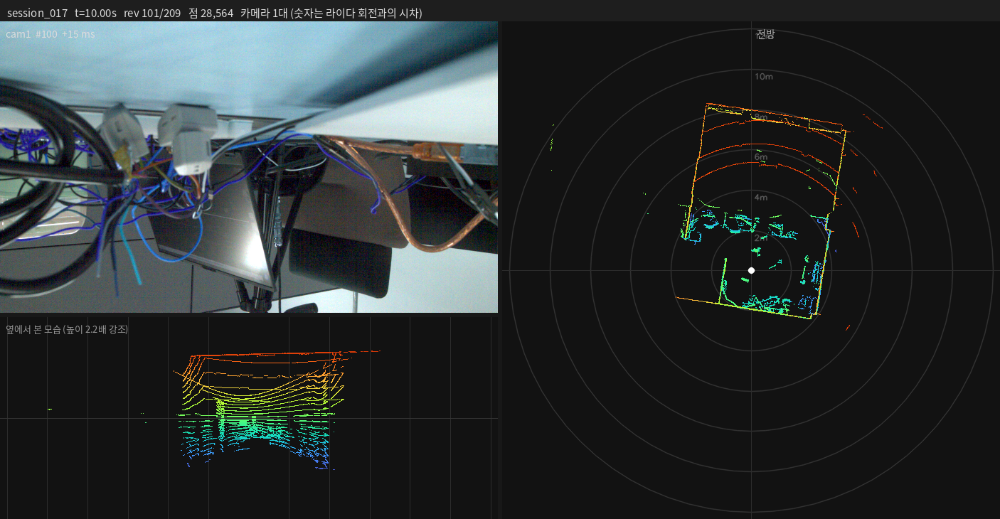
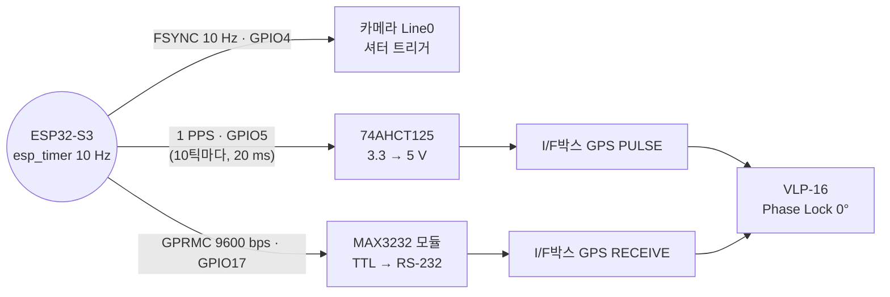

# 시간동기화 — 카메라·라이다 하드웨어 시각 동기

Daheng MER2-240-159U3C 카메라와 Velodyne VLP-16 라이다를 **ESP32-S3 하나의 타이머**에 묶어서, 카메라 셔터가 열리는 순간과 라이다가 정해진 방위각을 지나는 순간을 일치시킨 작업의 정리입니다.

작업 기간: 2026-09-09, 2026-09-14 ~ 09-15

---

## 결과

카메라 셔터가 열린 200번의 순간마다 라이다가 어느 방향을 보고 있었는지 측정했습니다 (목표 0°).

| 항목 | 값 |
|---|---|
| 셔터 순간 라이다 방위각 | 평균 **+0.015°**, 표준편차 0.38°, 범위 −0.93° ~ +1.22° |
| **시간 오차** | 평균 **0.000004 s**, 표준편차 **0.0001 s**, 최대 0.00034 s |
| 시간이 지나며 벌어짐 | 없음 — 두 센서가 같은 타이머에 묶여 있음 |
| 라이다 PPS | `Locked` (세션 전 구간) |
| 라이다 Phase Lock | `On`, offset 0°, 라이다 플래시에 저장 |
| GPRMC | 체크섬 정상, 라이다 타임스탬프의 초 = GPRMC 문장의 초 |
| 카메라 | 200 / 200장, FrameID 끊김 0, SDK lost 0 |
| 라이다 | 패킷 유실 0, 회전 주기 100.00 ± 0.037 ms |

측정 세션: [`results/session_017`](results/session_017) (카메라 1대 + 라이다, 20초). 아래 한 줄로 재현됩니다.

```bash
cd code && python3 sync_report.py ../results/session_017
```

시간 오차 ±0.0001 s는 라이다 모터가 회전 속도를 유지하며 생기는 흔들림(±0.4°)입니다. 평균 차이는 사실상 0입니다.



---

## 원리



세 가지가 맞물려 동작합니다.

1. **FSYNC와 PPS가 같은 순간에 나갑니다.** 펌웨어는 10 Hz 타이머 인터럽트 한 곳에서 FSYNC를 매 틱, PPS를 10틱마다 **같은 레지스터 쓰기**로 올립니다. 그래서 카메라 셔터는 항상 PPS 기준 0, 100, 200 … ms에 열립니다.
2. **PPS + Phase Lock이 라이다 회전 위상을 고정합니다.** Phase Lock은 PPS 펄스가 들어오는 순간 라이다가 지정한 방위각(offset)을 보고 있도록 모터를 맞춥니다. 600 rpm = 정확히 10 Hz이므로, 셔터가 열리는 매 순간 라이다는 offset 방향을 지나고 있습니다.
3. **GPRMC가 라이다 타임스탬프를 ESP32 시간축에 묶습니다.** 라이다의 '정시 이후 µs' 카운터가 GPRMC 문장의 분·초로 맞춰지므로, ESP32 로그의 트리거 시각을 라이다 시각으로 그대로 옮길 수 있습니다. 위 결과표의 방위각 측정이 이렇게 계산된 것입니다.

### "같은 순간"의 정확한 의미

- **라이다가 0°(정면)를 보는 방향에 대해서**입니다. 라이다는 100 ms에 한 바퀴 돌기 때문에 반대편(180°) 점들은 셔터보다 50 ms 앞이나 뒤에 찍힙니다. 카메라가 보는 방향의 각도를 Phase Lock `offset`에 넣어야 그 방향이 셔터와 맞습니다.
- **사진은 8 ms 동안 빛을 모은 것**입니다. 그동안 라이다는 약 29° 돕니다. 위 결과는 노출이 **시작되는** 순간 기준입니다. 노출 중간을 맞추려면 offset에서 약 14°를 빼면 됩니다.
- **파일에 찍힌 수신 시각으로 비교하면 15 ms 차이가 납니다.** `frames.csv`의 `host_recv_unix`는 사진이 PC에 **도착한** 시각이라 `노출시간 + 7.1 ms`(센서 읽기 + USB3 2.46 MB 전송)만큼 늦습니다 (노출 8 ms → 15.0 ms, 4 ms → 11.1 ms로 실측). 정확히 결합하려면 `mcu_log.txt`의 트리거 시각을 쓰세요.
- **GPRMC 시각은 실제 세계 시각이 아닙니다.** ESP32가 부팅할 때마다 12:00:00부터 세는 자체 시계입니다 (날짜 140826 고정). 세션 안에서는 일관되지만, ESP32를 재부팅하면 다시 12:00:00부터 시작합니다.

---

## 최종 배선

자세한 내용과 측정 체크리스트는 [`배선.md`](배선.md)에 있습니다.

| 출발 | 도착 |
|---|---|
| ESP32 **GPIO5** | 74AHCT125 **2번** → **3번** → I/F박스 **GPS PULSE** |
| ESP32 **GPIO17** | MAX3232 모듈 **TXD** |
| MAX3232 모듈 **RS-232 포트 2번** | I/F박스 **GPS RECEIVE** |
| ESP32 **5V** / **GND** | MAX3232 모듈 **VCC** / **GND** |
| ESP32 **GND** | 74AHCT125 **7번**·**1번**, I/F박스 **GND** (전부 공통) |
| ESP32 네이티브 **USB** 포트 | 노트북 (`/dev/ttyACM0`) |

> **MAX3232 모듈의 RXD는 연결하지 마세요.** 이 모듈은 TTL 쪽 표기가 반대라서 **TXD가 입력, RXD가 출력**입니다. VCC 5 V에서 RXD는 5 V를 내보내므로 ESP32(3.3 V)에 물리면 안 됩니다.

---

## 사용법

```bash
cd code
source /opt/ros/humble/setup.bash

python3 lidar_config.py                 # 라이다 PPS / NMEA / Phase Lock 상태
python3 record.py --duration 20         # 카메라 + 라이다 수집 (ESP32 핸드셰이크)
python3 record.py --lidar-only          # 카메라 없이 라이다만
python3 check_session.py sessions/session_NNN
python3 sync_report.py   sessions/session_NNN
python3 to_rosbag.py     sessions/session_NNN
python3 preview_session.py sessions/session_NNN --mp4
```

도구별 설명은 [`code/README.md`](code/README.md)에 있습니다.

> **현재 펌웨어는 PC가 ESP32 USB 시리얼을 읽어 주는 동안에만 PPS가 정상입니다.** 녹화 중에는 `record.py`가 시리얼을 읽으므로 문제없지만, 녹화 사이에는 라이다가 PPS를 잃습니다. 원인과 해결책은 [`트러블슈팅.md`](트러블슈팅.md#12-esp32가-시리얼이-막히면-pps를-내리지-못함)에 있습니다.

---

## 진행 경과

| 날짜 | 내용 |
|---|---|
| 09-09 | 라이다·카메라 연결 확인. 빈 폴더에서 수집 패키지 구축 (UDP→pcap 캡처, VLP-16 디코더, 검산기, rosbag 변환) |
| 09-09 | 측정해 보니 **주파수는 이미 10 Hz로 맞아 있었고**(3 ppm 차이) 문제는 **위상**이었음. 72.2 ms 어긋나 있었고 29분마다 한 프레임씩 밀림 |
| 09-09 | PPS가 `Absent`. 74AHCT125 버퍼를 넣고, **라이다 전원을 껐다 켜자** `Locked`. Phase Lock 적용 → 표류가 19시간에 한 프레임으로 줄어듦 |
| 09-09 | 남은 15 ms가 카메라 지연(노출 + 전송)임을 노출 실험으로 확인 |
| 09-14 | 카메라 없이 라이다 타임스탬프만으로 위상 잠금을 판정하는 방법 추가 |
| 09-14 | 전원 재투입 후 Phase Lock이 꺼져 있음 → 플래시 저장(`/cgi/save`)이 빠져 있었음 |
| 09-14 | I/F박스 GND 미연결, 5V 레일 이상을 차례로 해결 |
| 09-14 | **ESP32가 USB 시리얼이 막히면 PPS를 내리지 못하는 문제** 발견 → 수집 도구가 시리얼을 항상 읽도록 수정 |
| 09-15 | MAX3232 모듈 GND 미연결, **모듈 입력이 RXD가 아니라 TXD**였던 것을 정지 레벨 시험으로 찾음 → GPRMC 정상 수신 |
| 09-15 | ESP32 트리거 시각을 라이다 시각으로 옮겨 **셔터 순간 라이다 방위각**을 측정 → 오차 ±0.0001 s |

문제별 원인과 해결 과정은 [`트러블슈팅.md`](트러블슈팅.md)에 시간순으로 정리했습니다.

---

## 남은 과제

1. **ESP32 시리얼 막힘 (펌웨어)** — PC가 시리얼을 읽지 않으면 `loop()`가 멈춰 PPS가 HIGH에서 내려오지 못합니다. 펌웨어 `setup()`에 `Serial.setTxTimeoutMs(0);`을 넣어 USB 출력이 막혀도 기다리지 않게 하는 것이 해결책입니다 (아직 적용 안 함).
2. **Line1 노출 신호가 ESP32에 안 들어옴** — `CNT,200,0,396,0,0`에서 연결된 카메라 채널(1번)은 0이고, 채널 2(GPIO15)가 트리거의 약 2배를 셉니다. ESP32 로그의 엣지 시각을 보면 채널 2의 카운트는 **락아웃(50 ms)이 풀리자마자** 찍혀 있어, 카메라 노출이 아니라 떠 있는 입력의 잡음입니다 ([트러블슈팅 18번](트러블슈팅.md#18-line1-노출-신호가-esp32에-안-들어옴-미해결)). 촬영에는 영향이 없지만, **카메라 트리거 → 실제 노출 시작 지연을 잴 수단**과 트리거 번호 ↔ FrameID 검산이 막혀 있습니다.
3. **카메라 방향과 Phase Lock offset** — 지금 카메라는 천장을 보고 있고 offset은 0°입니다. 카메라를 라이다 수평면 쪽으로 향하게 한 뒤 그 방위각을 offset에 넣어야 합니다.
4. **카메라 노출** — 8 ms / 8 dB에서 화소 평균 10/255로 어둡습니다. 노출은 트리거 주기의 80%인 80 ms를 넘길 수 없습니다.

---

## 폴더 구성

```
시간동기화/
├── README.md            이 문서
├── 배선.md               최종 배선, 부품 핀 배치, 측정 체크리스트
├── 트러블슈팅.md          증상 → 원인 → 해결 (시간순)
├── code/                수집·검산·변환·시각화 도구
├── firmware/            ESP32-S3 스케치 (원본 + 진단용 사본 2개)
├── results/session_017/ 최종 검증 세션 (라이다 pcap, ESP32 로그, 카메라 타임스탬프, 미리보기)
└── docs/                09-09 시점 보고서와 참고 문서
```

## 장비

| 장비 | 내용 |
|---|---|
| 라이다 | Velodyne VLP-16-A, S/N 11206242275591, 192.168.1.201, 600 rpm, Strongest |
| 카메라 | Daheng MER2-240-159U3C × 4 (S/N FHH26070137~140), 2048×1200 BayerGB8, USB3 |
| MCU | ESP32-S3 개발보드, 네이티브 USB (`303a:1001`) |
| 레벨 변환 | 74AHCT125 (PPS), MAX3232 모듈 (GPRMC) |
| 호스트 | ASUS TUF Gaming A14, Ubuntu 22.04, ROS 2 Humble, Belkin TB5 Dock 2.5GbE (192.168.1.100/24) |
